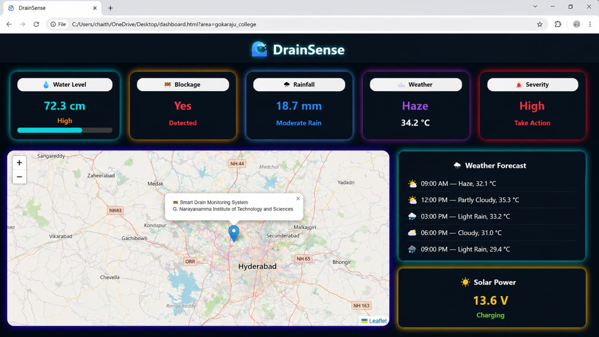
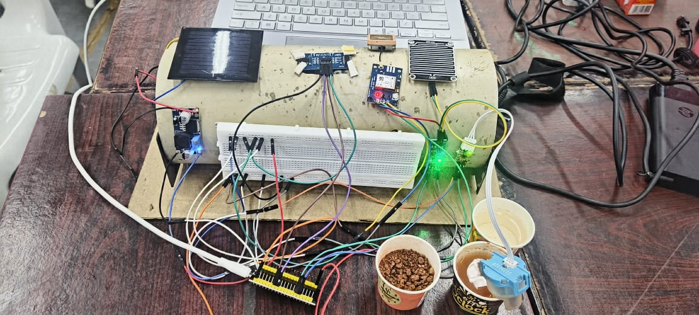
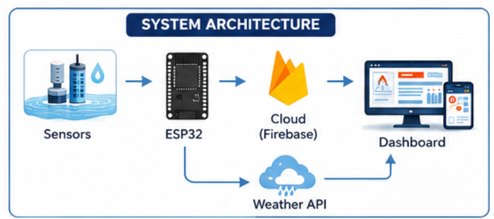
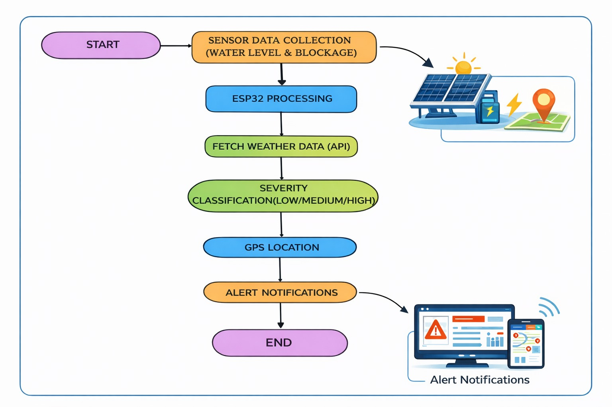

# Solar Powered Smart Drainage Monitoring System

## Overview
The Solar Powered Smart Drainage Monitoring System is an IoT-based solution developed to monitor drainage conditions and reduce overflow risks. The system utilizes an ESP32 microcontroller, Firebase cloud services, and a web-based dashboard to provide real-time monitoring and alert generation.

## Project Screenshots

### Dashboard

### Hardware Setup

### System Architecture

### Working Flow

## Features
- Real-time water level monitoring
- Drain blockage detection
- Rainfall monitoring
- Flood warning generation
- Firebase cloud integration
- Interactive web dashboard
- Weather API integration
- Location-based monitoring using maps
- Solar-powered operation

## Technologies Used
- ESP32
- Arduino IDE
- Firebase Realtime Database
- HTML
- CSS
- JavaScript
- OpenWeatherMap API
- Leaflet Maps
- Wi-Fi Communication

## Working Principle
The ESP32 continuously monitors drainage conditions and uploads sensor data to Firebase. The web dashboard retrieves the latest data from Firebase and displays water level, blockage status, rainfall intensity, weather information, and alert notifications in real time. Threshold-based logic is used to identify potential flood-risk conditions and generate warnings.

## Repository Structure

### Code
- drainage_monitoring_system.ino

### Dashboard
- index.html

### Images
- dashboard_screenshot.png
- hardware_setup.jpg
- system_architecture.png
- working_flow.png

## Team Members
- Bana Chaithanya Lakshmi
- Allenki Gayathri
- Malluri Sathya Vaishnavi

## Future Enhancements
- Mobile application integration
- SMS and email alert notifications
- Multi-node drainage monitoring
- AI-assisted flood prediction
